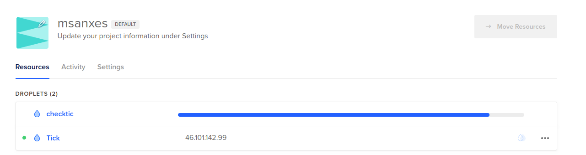
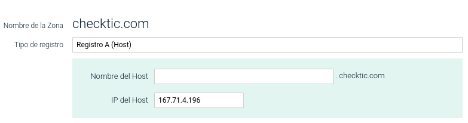
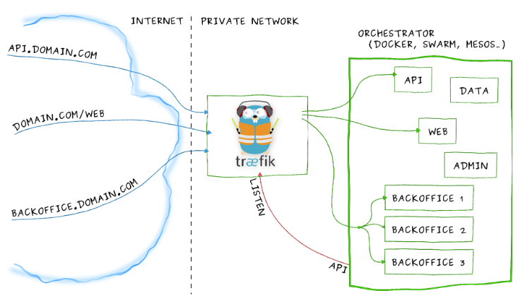
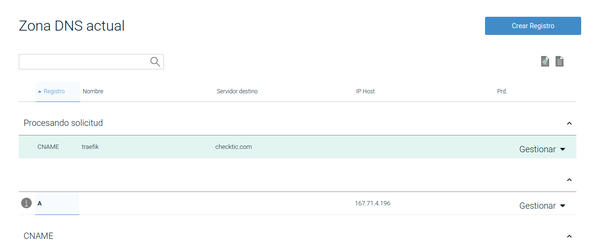
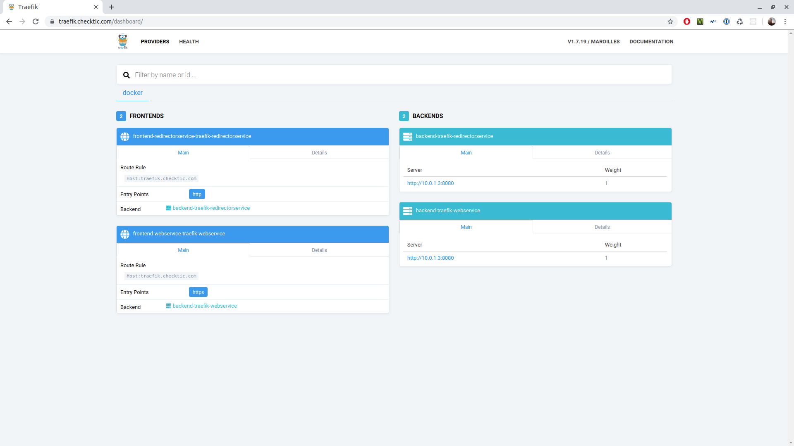

# Traefik - Proxy

En aquesta última part completarem tot el procés posant en pràctica el que s'ha treballat a les sessions anteriors i farem el què se'n diu, posar-ho a producció.

# Objectius 

- Crear un domini a internet
- Crear una màquina a internet i assignar-li el domini
- Inicialitzar un docker swarm
- Inicialitzar una xarxa overlay amb 1 sol node
- Inicialitzar traefik, proxy. 

Traefik funciona també de load balancer, es pot configurar per què apliqui tècniques round robin per a la càrrega dels diferents llocs que es tinguin replicats. En aquest cas l'objectiu és la diferenciació de serveis mitjançant el dns i no la creació de rèpliques. En la pràctica anterior ja es va cobrir aquest fet. 

L'objectiu principal és demostrar l'ús i l'escalabilitat de tot el que s'ha comentat fins ara, lligant els termes i l'ús de les sessions anteriors en una sola. Afegint també la complexitat de l'enrutament dins de la xarxa overlay en funció del domini pel que es pregunti. 

# Creació d'un domini. 

Aprofitant una conta creada amb Serveis Web [1] s'ha comprat un domini anomenat checktic.com. Aquest domini s'utilitzarà al llarg de la pràctica per realitzar totes les proves. 

Saltem tots els passos de inscripció que es demanen per la creació del mateix ja que és emplenar pantallassos d'informació reduntant. 

# Creació d'una màquina a internet

A sobre de la plataforma digitalocean [2], es crea el que s'anomena un droplet, una instància d'una màquina virtual al núvol. Aquesta màquina té la ip 167.71.4.196. 



Una vegada s'ha creat la màquina, se li assigna la ip des del proveïdor de noms dns al nom checktic.com.



# Inicialitzar un docker swarm

Primerament s'ha de crear l'usuari, s'ha d'actualitzar la màquina i s'ha de fer que l'usuari formi part del grup de sudoers. Així com també s'ha de fer que es pugui connectar per ssh aquest usuari, per tant s'ha d'instal·lar un servidor ssh. 

Seguim els passos per instal·lar docker, els podem trobar, o bé a la primera entrega de pràctiques o a la referència [3]. 

Afegirem alguns canvis a la instal·lació que ja hem vist, de fet simplement declararem algunes variables que utiltizarem al llarg del document. 

Declarem el hostname checktic.com com a varable global de la màquina.

```
$ export USE_HOSTNAME=checktic.com
$ echo $USE_HOSTNAME > /etc/hostname
$ hostname -F /etc/hostname
```

Per seguretat, docker recomana que l'usuari que executi totes les instruccions no sigui el root. Aixó és per què docker hereda els permissos d'accés a la màquina de l'usuari que el fa servir, és per aquest motiu que , tal i com es va fer a la primera part de les pràctiques es seguirà aquest patró i s'afegirà l'usuari al grup de docker. Per poder fer instruccions de docker sense sudo i per que així els contenidors no tinguin permissos extra que no necessiten. 

Inicialitzem un docker swarm.

```
$ docker swarm init --advertise-addr 167.71.4.196
Swarm initialized: current node (75udoxzaijpxeffib61u6xumn) is now a manager.

To add a worker to this swarm, run the following command:

    docker swarm join --token SWMTKN-1-1g62bxeoarpkr444cptru26kq6f3ebea3qlqnz83t3kbo9anso-5vs0hm4kvtne542vrwvffpkpg 167.71.4.196:2377

To add a manager to this swarm, run 'docker swarm join-token manager' and follow the instructions.
```

# Inicialització de la xarxa overlay

Per defecte quan es genera la un swarm docker, genera una xarxa overlay per el servei que s'anomena de routing mesh, el paquet de software s'anomena ingress. 

```
marc@checktic:~$ docker network ls
NETWORK ID          NAME                DRIVER              SCOPE
bd2992f0a084        bridge              bridge              local
e3c8c62f14a5        docker_gwbridge     bridge              local
14dcc75face0        host                host                local
fq3googpn0w8        ingress             overlay             swarm
39b253583fc6        none                null                local
```

En el nostre cas utiltizarem traefik per a la gestió del routing i el servidor proxy entre l'exterior i l'interior del swarm. Així doncs s'ha de crear la xarxa swarm que ens permeti aquest fet, l'anomenarem traefik-public.

```
marc@checktic:~$ docker network create --driver=overlay traefik-public
eec5inb6rqiyp2cszj937lnfj
```

S'ha de crear un volum de dades també per a que traefik pugui desar els certificats de connexió de let's encrypt per les connexions ssl. Ens dóna aquesta utilitat també. 

```
marc@checktic:~$ docker volume create traefik-public-certificates
traefik-public-certificates
```

# Desplegament de traefik

Podeu trobar la documentació del mateix a [https://docs.traefik.io/v1.4/](https://docs.traefik.io/v1.4/) [4]

A partir d'ara ens desem l'identificador docker del node manager (és a dir la màquina que estem fent servir) en una variable d'entorn per poder utilitzar-la més endavant. També li assignem una etiqueta al node, aquests passos es fan suposant que traefik sempre serà desplegat en aquest node i que farà servir sempre aquest volum. 

```
export NODE_ID=$(docker info -f '{{.Swarm.NodeID}}')
docker node update --label-add traefik-public.traefik-public-certificates=true $NODE_ID
```

Assignem algunes variables més per a la creació del docker que contindrà traefik. El funcionament de traefik és semblant a : 



```
marc@checktic:~$ export USERNAME=admin
marc@checktic:~$ export PASSWORD=NoElPosaréAquí...
marc@checktic:~$ export HASHED_PASSWORD=$(openssl passwd -apr1 $PASSWORD)
```

Finalment aixequem traefik amb totes les variables d'entorn que hem anat declarant. Amb traefik en marxa podrem configurar les diferents opcions per poder fer de proxy o de load balancer així com controlar la gestió de certificats digitals per a les connexions ssl. 

```
marc@checktic:~$ docker service create \
>     --name traefik \
>     --constraint=node.labels.traefik-public.traefik-public-certificates==true \
>     --publish 80:80 \
>     --publish 443:443 \
>     --mount type=bind,source=/var/run/docker.sock,target=/var/run/docker.sock \
>     --mount type=volume,source=traefik-public-certificates,target=/certificates \
>     --network traefik-public \
>     --label "traefik.frontend.rule=Host:traefik.$USE_HOSTNAME" \
>     --label "traefik.enable=true" \
>     --label "traefik.port=8080" \
>     --label "traefik.tags=traefik-public" \
>     --label "traefik.docker.network=traefik-public" \
>     --label "traefik.redirectorservice.frontend.entryPoints=http" \
>     --label "traefik.redirectorservice.frontend.redirect.entryPoint=https" \
>     --label "traefik.webservice.frontend.entryPoints=https" \
>     --label "traefik.frontend.auth.basic.users=${USERNAME}:${HASHED_PASSWORD}" \
>     traefik:v1.7 \
>     --docker \
>     --docker.swarmmode \
>     --docker.watch \
>     --docker.exposedbydefault=false \
>     --constraints=tag==traefik-public \
>     --entrypoints='Name:http Address::80' \
>     --entrypoints='Name:https Address::443 TLS' \
>     --acme \
>     --acme.email=$EMAIL \
>     --acme.storage=/certificates/acme.json \
>     --acme.entryPoint=https \
>     --acme.httpChallenge.entryPoint=http\
>     --acme.onhostrule=true \
>     --acme.acmelogging=true \
>     --logLevel=INFO \
>     --accessLog \
>     --api
1trdh811beal80yp25q011mxh
overall progress: 1 out of 1 tasks 
1/1: running   
verify: Service converged 
```

The previous command explained: [5]

docker service create: create a Docker Swarm mode service
+ --name traefik: name the service "traefik"
+ --constraint=node.labels.traefik-public.traefik-public-certificates==true make it run on a specific node, to be able to use the certificates stored in a volume in that node
+ --publish 80:80: listen on ports 80 - HTTP
+ --publish 443:443: listen on port 443 - HTTPS
+ --mount type=bind,source=/var/run/docker.sock,target=/var/run/docker.sock: communicate with Docker, to read labels, etc.
+ --mount type=volume,source=traefik-public-certificates,target=/certificates: create a volume to store TLS certificates
+ --network traefik-public: listen to the specific network traefik-public
+ --label "traefik.frontend.rule=Host:traefik.$USE_HOSTNAME": enable the Traefik API and dashboard in the host traefik.$USE_HOSTNAME, using the $USE_HOSTNAME environment variable created above
+ --label "traefik.enable=true": make Traefik expose "itself" as a Docker service, this is what makes the Traefik dashboard available with HTTPS and basic auth
+ --label "traefik.port=8080": when Traefik exposes itself as a service (for the dashboard), use the internal service port 8080
+ --label "traefik.tags=traefik-public": as the main Traefik proxy will only expose services with the traefik-public tag (using a parameter below), make the dashboard service have this tag too, so that the Traefik public (itself) can find it and expose it
+ --label "traefik.docker.network=traefik-public": make the dashboard service use the traefik-public network to expose itself
+ --label "traefik.redirectorservice.frontend.entryPoints=http": make the web dashboard listen to HTTP, so that it can redirect to HTTPS
+ --label "traefik.redirectorservice.frontend.redirect.entryPoint=https": make Traefik redirect HTTP trafic to HTTPS for the web dashboard
+ --label "traefik.webservice.frontend.entryPoints=https": make the web dashboard listen and serve on HTTPS
+ --label "traefik.frontend.auth.basic.users=${USERNAME}:${HASHED_PASSWORD}": enable basic auth, so that not every one can access your Traefik web dashboard, it uses the username and password created above
traefik:v1.7: use the image traefik:v1.7
+ --docker: enable Docker
+ --docker.swarmmode: enable Docker Swarm Mode
+ --docker.watch: enable "watch", so it reloads its config based on new stacks and labels
+ --docker.exposedbydefault=false: don't expose all the services, only services with traefik.enable=true
+ --constraints=tag==traefik-public: only show services with traefik.tag=traefik-public, to isolate from possible intra-stack traefik instances
+ --entrypoints='Name:http Address::80': create an entrypoint http, on port 80
+ --entrypoints='Name:https Address::443 TLS': create an entrypoint https, on port 443 with TLS enabled
+ --acme: enable Let's encrypt
+ --acme.email=$EMAIL: let's encrypt email, using the environment variable
+ --acme.storage=/certificates/acme.json: where to store the Let's encrypt TLS certificates - in the mapped volume
+ --acme.entryPoint=https: the entrypoint for Let's encrypt - created above
+ --acme.httpChallenge.entryPoint=http: use HTTP for the ACME (Let's Encrypt HTTPS certificates) challenge, as HTTPS was disabled after a security issue
+ --acme.onhostrule=true: get new certificates automatically with host rules: "traefik.frontend.rule=Host:web.example.com"
+ --acme.acmelogging=true: log Let's encrypt activity - to debug when and if it gets certificates
+ --logLevel=INFO: default logging, if the web UI is not enough to debug configurations and hosts detected, or you want to see more of the logs, set it to DEBUG. Have in mind that after some time it might affect performance.
+ --accessLog: enable the access log, to see and debug HTTP traffic
+ --api: enable the API, which includes the dashboard


Amb totes aquestes opcions se li ha passat part de la configuració així com se li ha enllaçat els ports de l'exterior amb els de l'interior de la xarxa (80 i 443).  Se li ha assignat el volum, se li ha dit que gestioni els certificats digitals amb let's encrypt i se li ha activat la API. 

A partir d'aquest moment podem accedir a la suite d'administració de traefik, una plataforma web que permet la configuració del mateix de manera més visual. Per fer-ho s'ha de generar un CNAME al servidor de noms de domini on hem contractat el domini anterior. 



Un cop fet aixó i esparada la propagació del domini, fem màgia.



# Referències 

- [1] - [Serveis Web](https://www.swhosting.com/)
- [2] - [Digital Ocean](https://cloud.digitalocean.com/)
- [3] - [Instal·lació Docker](https://docs.docker.com/install/linux/docker-ce/ubuntu/)
- [4] - [Documentació de traefik](https://docs.traefik.io/v1.4/)
- [5] - [Explicació de la instrucció per desplegar traefik](https://medium.com/@tiangolo/docker-swarm-mode-and-traefik-for-a-https-cluster-20328dba6232#8386)